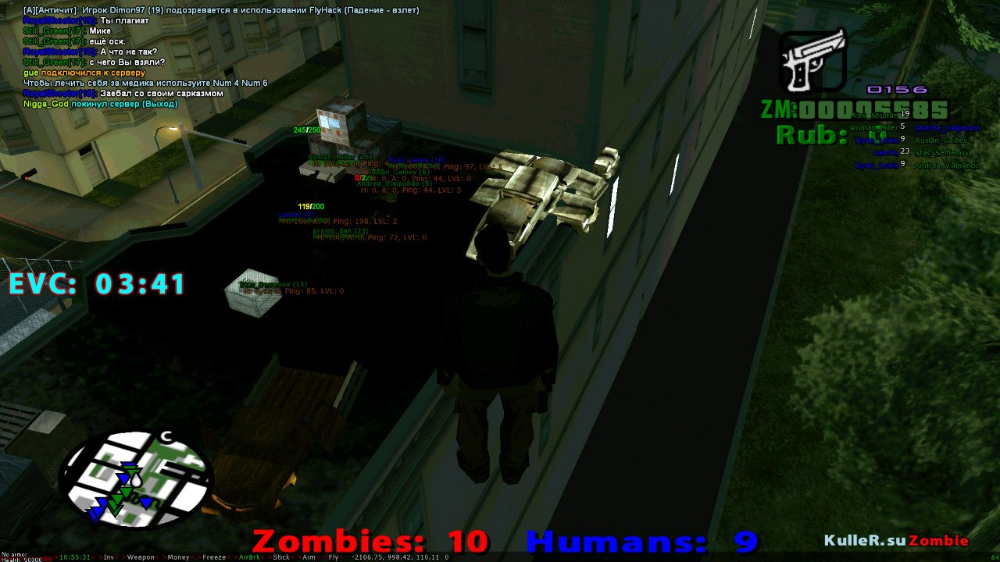

# KulleR.su

Old project of my game server based on the San Andreas Multiplayer client.

## ToDo:
- [x] Compile and run latest v.23-2f gamemode
- [x] Create config for vscode for a right encoding suggestion (CP-1251)
- [x] Adopt the mod for open.mp
- [ ] Attempt to restore the IPB engine
- [ ] Configure .gitignore for server files

## File Structure

| Path | Content |
| ---- | ------- |
| `fm/` | Radio fm.kuller.su |
| `samp_mod/*/` | SA-MP server (Game mod, Scripts, Plugins) |
| `kuller.su/` | Main forum with some integrations for the SA-MP server |
|  `docs` | Documentation folder

## Technology Stack:

- [PAWN](https://github.com/pawn-lang/compiler) - Game modification language
- [Invision Power Board](https://invisioncommunity.com/files/) - Forum for the server
- [MySQL](https://www.mysql.com) - Database management system for IPB and sync with game client
- [Data Life Engine](https://dle-news.ru) - Engine for the FM and unreleased main site

## Installation

See under the [docs folder](docs/installation.md)

## License

KulleR.su project is licensed under the [MIT license](LICENSE)

## Some screenshots from SAMP server

## Old gameplay video from server

